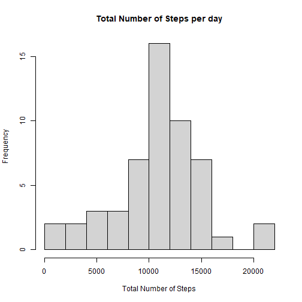
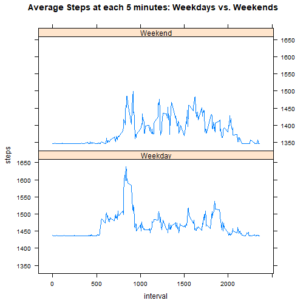

## Loading and Preprocessing the data

For loading and preprocessing the activity data, first, the "read table" and "unz" functions were used. 
The "date" column were transformed on date variable and the data were split by this column. The following code is able to read and preprocess the data for consecutive use along the analysis: 


```r
act <- read.table(unz("activity.zip", "activity.csv"), sep=",", header = TRUE)
act$date <- as.Date(act$date)
```

## What is mean total number of steps taken per day?

### Total number of steps taken each day 

```r
library(dplyr)
```


```r
byday <- group_by(act, date)
total <- summarize(byday, Total = sum(steps, na.rm = TRUE))
```

### Histogram of the total number of steps taken each day


```r
hist <- hist(total$Total, breaks = 10, xlab = "Total Number of Steps", ylab = "Frequency", main = "Total Number of Steps per day")
```



### Mean and median number of steps taken each day

To calculate the mean and mean the following code was used. 

```r
mn <- mean(total$Total)
mn
```

```
## [1] 9354.23
```

```r
mdn <- median (total$Total)
mdn
```

```
## [1] 10395
```
Therefore, the mean and median were 9354.2295082 and 10395 respectively 


## What is the average daily activity pattern?

### Time series plot of the 5-minute interval (x-axis) and the average number of steps taken, averaged across all days (y-axis)

For this, I decided to use the aggregate function this time, to familiarize myself with it. 


```r
int <- aggregate(steps ~ interval, FUN=mean, data = act )

plot1 <- plot(int$interval, int$steps, type = "l", xlab = "interval", ylab = "steps" )
```


### Which 5-minute interval, on average across all the days in the dataset, contains the maximum number of steps?

To answer this question the subset function was used. This function subsetted the row of the interval column corresponding to the largest number on the steps column. 


```r
interval <- subset(int$interval, subset = int$steps==max(int$steps))
```

The interval that contains the maximum number of steps is 835


## Imputing missing values

###  Total number of missing values in the dataset

To check how many NA there are in the dataset, the summary function is enough 

```r
summary(act)
```

```
##      steps             date               interval     
##  Min.   :  0.00   Min.   :2012-10-01   Min.   :   0.0  
##  1st Qu.:  0.00   1st Qu.:2012-10-16   1st Qu.: 588.8  
##  Median :  0.00   Median :2012-10-31   Median :1177.5  
##  Mean   : 37.38   Mean   :2012-10-31   Mean   :1177.5  
##  3rd Qu.: 12.00   3rd Qu.:2012-11-15   3rd Qu.:1766.2  
##  Max.   :806.00   Max.   :2012-11-30   Max.   :2355.0  
##  NA's   :2304
```
There are 2304 NA's in the dataset

### Filling the missing values and creating new dataset with no NA's 


```r
actnona <- read.table(unz("activity.zip", "activity.csv"), sep=",", header = TRUE)
actnona[is.na(actnona)]<- mn 
summary(act)
```

```
##      steps             date               interval     
##  Min.   :  0.00   Min.   :2012-10-01   Min.   :   0.0  
##  1st Qu.:  0.00   1st Qu.:2012-10-16   1st Qu.: 588.8  
##  Median :  0.00   Median :2012-10-31   Median :1177.5  
##  Mean   : 37.38   Mean   :2012-10-31   Mean   :1177.5  
##  3rd Qu.: 12.00   3rd Qu.:2012-11-15   3rd Qu.:1766.2  
##  Max.   :806.00   Max.   :2012-11-30   Max.   :2355.0  
##  NA's   :2304
```

## Are there differences in activity patterns between weekdays and weekends?


### "Create a new factor variable in the dataset with two levels – “weekday” and “weekend” indicating whether a given date is a weekday or weekend day."

The first thing is to transform the date column of the data frame with no NA's in date format. Then, create two factor vectors  containing the weeekdays from the data frame and binding them as columns to the data frame. 

To create a factor column indicating if it is weekday or weekend, the which function was used. The function takes the wd column and checks for "Sunday" or "Saturday" words and for them, it changes the corresponding rows on the column "daytype" to "Weekend" 

```r
actnona$date <- as.Date(act$date)
daytype <- as.factor(weekdays(actnona$date))
wd <- as.factor(weekdays(actnona$date))
actwd <- cbind(actnona, daytype, wd)
actwd$daytype <- "Weekday"
actwd$daytype[which(actwd$wd %in% c("Saturday", "Sunday"))] <- "Weekend"
rm(daytype)
```

### "Make a panel plot containing a time series plot (i.e. type = "l") of the 5-minute interval (x-axis) and the average number of steps taken, averaged across all weekday days or weekend days (y-axis). See the README file in the GitHub repository to see an example of what this plot should look like using simulated data."

First use aggregate to split the data and calculate mean. The steps data is y and interval is x. But the steps column is being split by daytype and interval and the mean is applied to steps. 

Later this object is used in the plot (using lattice). The y is steps, x is interval, all divided by daytype (weekday or weekend). The type of the plot is "l" meaning that it is a time plot, with the layout as one column and two rows, therefore one plot on top of the other, with simples lines. 


```r
int <- aggregate(steps ~ daytype + interval, FUN=mean, data = actwd)

library(lattice)
xyplot(steps ~ interval|daytype , int,  type = "l", layout = c(1,2), lty = 1, main = "Average Steps at each 5 minutes: Weekdays vs. Weekends")
```




